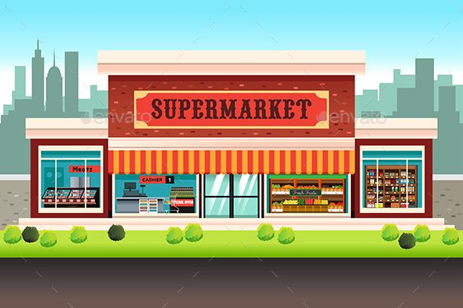

# 🛒 Supermarket Mini Project

A full-stack **Supermarket Management System** built with **Node.js**, **Express**, **HTML/CSS**, and **EJS**. This project provides a simple and user-friendly interface for managing supermarket products.

---

## 🚀 Features

- **User Authentication**: Register and login functionality.
- **Product Management**: Add, update, delete, and list products.
- **Dashboard**: Quick access to all operations.
- **Product Summary**: View details of all available products.
- **Responsive UI**: Simple and easy-to-use interface.

---

## 🛠 Tech Stack

- **Backend**: Node.js, Express.js
- **Frontend**: HTML, CSS, EJS Templates
- **Data Handling**: Client-side logic in JavaScript

---

## 📂 Project Structure

```
Supermarket-Mini-Project/
├── app.js                 # Main server file
├── client.js              # Client-side scripts
├── public/                # HTML pages & static assets
│   ├── addProduct.html
│   ├── dashboard.html
│   ├── deleteProduct.html
│   ├── listProducts.html
│   ├── login.html
│   ├── productSummary.html
│   ├── register.html
│   ├── updateProduct.html
│   └── Images/
├── views/                 # EJS templates
│   └── listProducts.ejs
```

---

## ⚙️ Setup Instructions

1. **Clone the repository**
   ```bash
   git clone https://github.com/<your-username>/Supermarket-Mini-Project.git
   cd Supermarket-Mini-Project
   ```

2. **Install dependencies**
   ```bash
   npm install
   ```

3. **Run the project**
   ```bash
   node app.js
   ```

4. **Open in browser**
   ```
   http://localhost:3000
   ```

---

## 📸 Screenshots

| Login Page | Dashboard | Product List |
|-----------|-----------|-------------|
|  |  |  |

> *You can replace the above images with your own project screenshots after running the app.*

---

## 📢 Contributing

Pull requests are welcome. For major changes, please open an issue first to discuss what you would like to change.

---

## 📜 License

This project is licensed under the MIT License - see the [LICENSE](LICENSE) file for details.
